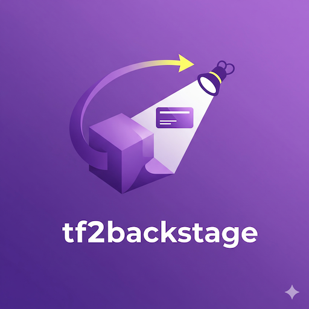

# tf2backstage



[](https://hub.docker.com/r/lowess/tf2backstage)
[](https://hub.docker.com/r/lowess/tf2backstage)
[](https://github.com/lowess/tf2backstage)

`tf2backstage` is a powerful CLI tool that converts Terraform output JSON into Backstage Resource YAML. It helps you automate the creation of Backstage catalog entities from your Terraform-managed infrastructure, making it easy to keep your Backstage catalog in sync with your cloud resources.

## ✨ Features

- **🔄 Seamless Integration**: Convert any Terraform output to Backstage-compatible YAML
- **🎨 Colorized Output**: Beautiful syntax highlighting with `yq` (optional)
- **🏷️ Smart Tagging**: Custom tags with support for dynamic data extraction
- **📝 Flexible Naming**: Use literal names or extract from Terraform data with `@field` syntax
- **📄 Custom Descriptions**: Set custom descriptions or use smart defaults
- **🎛️ Highly Configurable**: Customize owners, systems, types, annotations, and more
- **🔍 Field Filtering**: Exclude sensitive or unnecessary data with regex patterns
- **📦 Docker Ready**: Lightweight container for easy CI/CD integration
- **🚀 Stdin/File Support**: Works with pipes or file inputs
- **🌐 Batch Processing**: Process all Terraform outputs or specific keys

## 🚀 Quick Start

### Installation

**Option 1: Use Pre-built Image (Recommended)**

```bash
# Pull the latest image from Docker Hub
docker pull lowess/tf2backstage:latest

# Create a convenient alias
alias tf2backstage='docker run --rm -i -v "$PWD":/work lowess/tf2backstage'
```

**Option 2: Build from Source**

```bash
# Build the Docker image locally
docker build -t lowess/tf2backstage .

# Create a convenient alias
alias tf2backstage='docker run --rm -i -v "$PWD":/work lowess/tf2backstage'
```

### Basic Usage

```bash
# From Terraform output file
tf2backstage -f tf-output.json --output-key eks > eks-resource.yaml

# From stdin (pipe Terraform output directly)
terraform output -json | tf2backstage --output-key eks > eks-resource.yaml
```

## 📖 Usage Examples

### Basic EKS Cluster Resource

```bash
# Generate a basic Backstage resource for an EKS cluster
terraform output -json | tf2backstage \
  --output-key eks \
  --name @cluster_name \
  --type kubernetes-cluster \
  --owner platform-team \
  --system kubernetes
```

**Output:**

```yaml
apiVersion: backstage.io/v1alpha1
kind: Resource
metadata:
  name: my-eks-cluster
  description: Resource generated from Terraform output
  tags:
    - eks
  annotations:
    gumgum.com/eks/cluster_arn: "arn:aws:eks:us-west-2:123456789012:cluster/my-eks-cluster"
    gumgum.com/eks/cluster_endpoint: "https://ABC123.gr7.us-west-2.eks.amazonaws.com"
    gumgum.com/eks/cluster_version: "1.28"
    # ... more annotations
spec:
  type: kubernetes-cluster
  owner: platform-team
  system: kubernetes
```

### Custom Tags and Advanced Options

```bash
# Production EKS with custom tags and filtering
terraform output -json | tf2backstage \
  --output-key eks \
  --name @cluster_name \
  --tags "kubernetes,aws,production,eks" \
  --type kubernetes-cluster \
  --owner devops \
  --system production \
  --exclude-re 'kms_|cluster_addons' \
  --omit-null \
  --description "Production EKS cluster managed by Terraform"
```

### RDS Database Resource

```bash
# RDS instance with database-specific configuration
terraform output -json | tf2backstage \
  --output-key rds \
  --name @db_instance_id \
  --tags "database,postgresql,production" \
  --type database \
  --owner data-team \
  --system data-platform \
  --ann-prefix "company.com/database" \
  --description "Production PostgreSQL database"
```

### S3 Bucket Resource

```bash
# S3 bucket for data storage
terraform output -json | tf2backstage \
  --output-key s3_bucket \
  --name @bucket_name \
  --tags "storage,s3,data-lake" \
  --type storage \
  --owner analytics-team \
  --exclude-re 'lifecycle_|notification_'
```

### Process All Terraform Outputs

```bash
# Generate a single resource with all terraform outputs as annotations
terraform output -json | tf2backstage \
  --name "terraform-outputs" \
  --description "All Terraform outputs for this deployment" \
  --tags "terraform,infrastructure,all-outputs" \
  --type infrastructure \
  --owner platform-team \
  --system deployment
```

**Output:**

```yaml
apiVersion: backstage.io/v1alpha1
kind: Resource
metadata:
  name: terraform-outputs
  description: All Terraform outputs for this deployment
  tags:
    - terraform
    - infrastructure
    - all-outputs
  annotations:
    gumgum.com/terraform/eks_cluster_arn: "arn:aws:eks:us-west-2:123456789012:cluster/my-cluster"
    gumgum.com/terraform/rds_endpoint: "mydb.123456.us-west-2.rds.amazonaws.com"
    gumgum.com/terraform/s3_bucket_name: "my-app-storage-bucket"
    # ... all other terraform outputs
spec:
  type: infrastructure
  owner: platform-team
  system: deployment
```

## 🎛️ Configuration Options

| Option              | Description                           | Example                        |
| ------------------- | ------------------------------------- | ------------------------------ |
| `-f, --file`        | Input Terraform JSON file             | `-f terraform.json`            |
| `-k, --output-key`  | Key in Terraform output _(optional)_  | `--output-key eks`             |
| `-n, --name`        | Resource name (literal or `@field`)   | `--name @cluster_name`         |
| `-d, --description` | Custom description (default provided) | `--description "My resource"`  |
| `-t, --type`        | Backstage resource type               | `--type kubernetes-cluster`    |
| `-o, --owner`       | Resource owner                        | `--owner platform-team`        |
| `-s, --system`      | System the resource belongs to        | `--system kubernetes`          |
| `-p, --ann-prefix`  | Annotation prefix                     | `--ann-prefix company.com/eks` |
| `-x, --exclude-re`  | Regex to exclude annotations          | `--exclude-re 'kms_\|secret_'` |
| `--omit-null`       | Omit null values from annotations     | `--omit-null`                  |
| `--tags`            | Comma-separated tags                  | `--tags "k8s,aws,prod"`        |
| `--no-color`        | Disable syntax highlighting           | `--no-color`                   |

## 💡 Advanced Use Cases

### CI/CD Pipeline Integration

```yaml
# GitHub Actions example
- name: Generate Backstage Resources
  run: |
    terraform output -json > tf-output.json

    # EKS Cluster
    tf2backstage -f tf-output.json \
      --output-key eks \
      --name @cluster_name \
      --tags "kubernetes,aws,${{ github.ref_name }}" \
      --type kubernetes-cluster \
      --owner platform-team > backstage/eks.yaml

    # RDS Database
    tf2backstage -f tf-output.json \
      --output-key rds \
      --name @db_name \
      --tags "database,postgresql,${{ github.ref_name }}" \
      --type database \
      --owner data-team > backstage/rds.yaml
```

### Multi-Environment Setup

```bash
# Development environment
terraform output -json | tf2backstage \
  --output-key app_service \
  --name "${ENV}-@service_name" \
  --tags "webapp,dev,microservice" \
  --owner dev-team \
  --system development

# Production environment
terraform output -json | tf2backstage \
  --output-key app_service \
  --name "prod-@service_name" \
  --tags "webapp,production,microservice" \
  --owner platform-team \
  --system production \
  --exclude-re 'debug_|test_' \
  --omit-null
```

### Custom Annotation Prefixes

```bash
# Company-specific annotations
tf2backstage \
  --output-key infrastructure \
  --ann-prefix "acme.corp/infra" \
  --exclude-re 'internal_|private_'

# Team-specific annotations
tf2backstage \
  --output-key service \
  --ann-prefix "platform.team/services" \
  --tags "@service_type,@environment"
```

## 🔧 Template Customization

The tool uses Jinja2 templates that can be customized. The default template creates standard Backstage Resource entities, but you can modify `tf2backstage.j2` to:

- Change the YAML structure
- Add custom fields
- Modify annotation formatting
- Include additional metadata

## 🐳 Docker Usage

### One-time Usage

```bash
docker run --rm -i -v "$PWD":/work lowess/tf2backstage \
  --output-key eks \
  --name @cluster_name < tf-output.json
```

### With Alias (Recommended)

```bash
# Set up the alias once
alias tf2backstage='docker run --rm -i -v "$PWD":/work lowess/tf2backstage'

# Use it like a local command
terraform output -json | tf2backstage --output-key eks
```

## 📝 Output Examples

### Minimal Output

```yaml
apiVersion: backstage.io/v1alpha1
kind: Resource
metadata:
  name: my-service
  description: Resource generated from Terraform output
  tags:
    - webapp
spec:
  type: service
  owner: backend-team
  system: default
```

### Rich Output with Annotations

```yaml
apiVersion: backstage.io/v1alpha1
kind: Resource
metadata:
  name: prod-api-gateway
  description: Production API Gateway
  tags:
    - api-gateway
    - aws
    - production
  annotations:
    company.com/api/gateway_id: "abc123def456"
    company.com/api/endpoint_url: "https://api.example.com"
    company.com/api/stage: "prod"
    company.com/api/throttle_rate: "1000"
spec:
  type: api
  owner: platform-team
  system: production
```

## 🤝 Contributing

Contributions are welcome! Please feel free to submit issues, feature requests, or pull requests.
